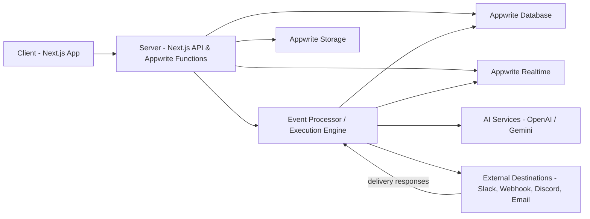
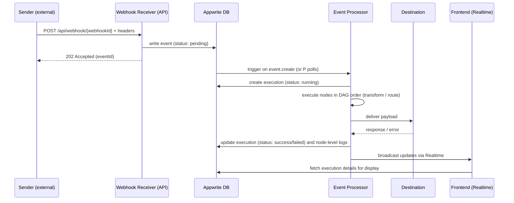
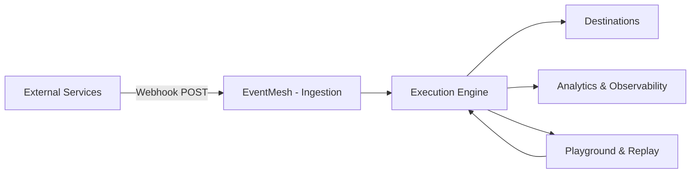
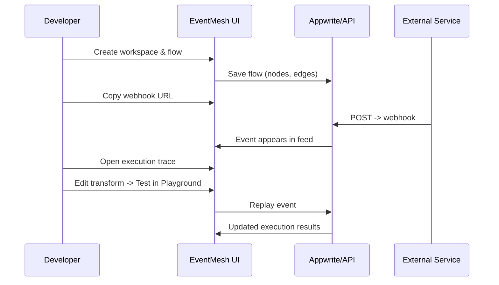
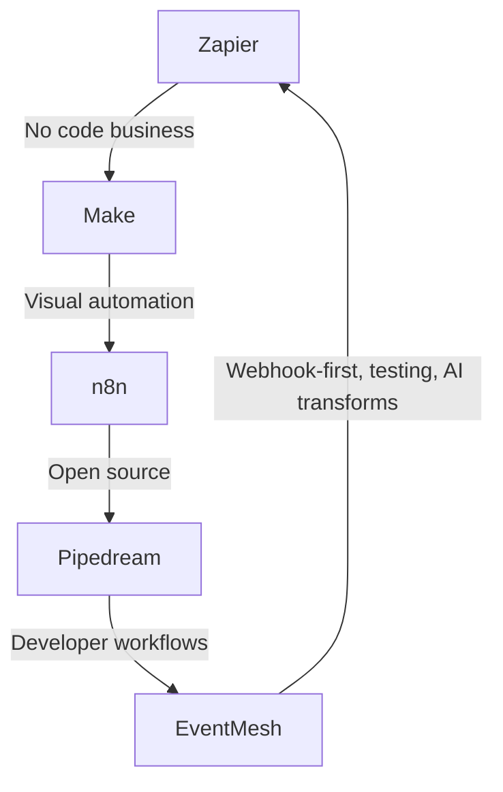
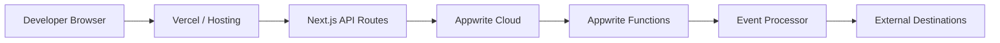
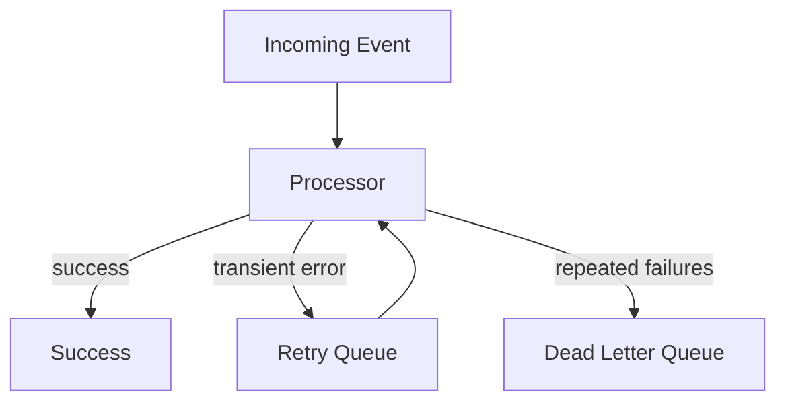

# EventMesh

<div align="center">


**The Next-Generation Visual Event Routing Platform**

Build complex webhook workflows with drag-and-drop simplicity, AI-powered transformations, and real-time processing.

[](https://nextjs.org/)
[](https://appwrite.io)
[](https://www.typescriptlang.org/)
[](https://opensource.org/licenses/MIT)

[Live Demo](#) · [Documentation](./app/docs/README.md) · [Quick Start](./app/docs/QUICKSTART.md) · [API Reference](./app/docs/api-reference.md)

</div>

---

## What is EventMesh?

EventMesh is a **visual webhook routing platform** that makes event-driven architecture accessible to everyone. Instead of writing complex glue code, you **drag, drop, and connect** nodes to create powerful event processing pipelines.

### The Problem

Traditional webhook management is painful:

- Complex integration code for every service
- Limited visibility into event flow
- Time-consuming debugging
- Repetitive transformation logic
- Limited monitoring and analytics

# EventMesh

EventMesh is a developer-first visual event routing platform designed to simplify, test, and operate webhook-driven integrations and event pipelines.

This repository contains the frontend application (Next.js + TypeScript) and supporting libraries for building, running, and testing flows that accept webhooks, run transformations (JavaScript or AI-assisted), and deliver events to destinations such as webhooks, Slack, Discord, or other APIs.

Table of contents

- Overview
- Motivation and value proposition
- Core concepts
- Architecture (high-level)
- Data flow (sequence)
- Features
- How EventMesh helps developers and testers
- Comparison with competing tools
- Quickstart (local development)
- Appwrite backend and collections (summary)
- Deployment notes
- Security considerations
- Contributing
- Roadmap
- License

## Overview

EventMesh provides a visual flow builder and an execution engine to route events from HTTP webhooks through transform steps to one or more destinations. The platform emphasizes developer productivity, observability, and safe experimentation via replay and testing tools.

Key properties:

- Visual flow builder (drag-and-drop)
- Transform nodes: JavaScript-first, optional AI assist for code generation and schema extraction
- Event ingestion via authenticated webhook endpoints
- Execution records and step-level tracing for observability
- Replay, playground, and testing tooling for QA
- Built on Appwrite for data, functions, and realtime subscriptions (configurable)

## Motivation and value proposition

Developers and QA teams often spend significant time wiring webhooks, creating transformation logic, and debugging event delivery problems. EventMesh reduces friction by:

- Offering a visual way to compose event pipelines, reducing boilerplate code
- Providing safe execution contexts for transformations with clear execution logs
- Allowing quick iteration via a built-in playground and event replay
- Offering analytics and success/failure visibility for operational monitoring

This combination shortens feedback loops, reduces integration bugs, and helps teams deliver reliable event-driven integrations faster.

## Core concepts

- Flow: a named DAG of nodes (source → transforms → destinations) saved per workspace.
- Node: a functional block; types include Source, Transform, and Destination.
- Source: generates webhook URLs that external systems post to.
- Transform: user-provided JavaScript or AI-generated code that mutates or filters payloads.
- Destination: an external endpoint (webhook, Slack, Discord) to which transformed payloads are delivered.
- Event: the record created when an external POST hits a Source webhook.
- Execution: the record and trace created when a flow processes an Event.

## Architecture (high-level)

The system separates concerns into Client, Orchestration, Data, and External layers. The following Mermaid diagram shows the high-level architecture.



## Tech stack

This project uses the following technologies and libraries. The list is intended to help contributors and reviewers quickly understand the technology surface.

- Frontend

  - Next.js (App Router) — server and client rendering
  - React
  - TypeScript
  - Tailwind CSS
  - shadcn/ui (component primitives)
  - React Flow (visual flow builder)
  - Recharts (analytics)

- State & data fetching

  - Zustand (client state)
  - Optional: TanStack Query / React Query (where used)

- Backend & runtime

  - Appwrite (Database, Functions, Realtime, Auth, Storage)
  - Node.js 20 for serverless functions and function runtimes
  - Next.js API Routes for server-side endpoints

- AI

  - OpenAI (GPT) and/or Google Generative AI (Gemini) integration for AI-assisted transforms and flow generation

- Integrations / Destinations

  - Slack, Discord, generic Webhooks, Email (Resend or similar)

- Dev tooling

  - ESLint, Prettier
  - TypeScript compiler (tsc)
  - Husky + lint-staged (recommended for pre-commit)
  - Vitest or Jest (unit tests)

- CI / CD

  - GitHub Actions (recommended) for CI workflows and releases
  - Dependabot for dependency updates

- Local development & deployment
  - Vercel (recommended for frontend hosting)
  - Docker / Docker Compose for local Appwrite (optional)

## Data flow (sequence)

The following sequence diagram illustrates a typical event lifecycle from ingestion to delivery and UI update.



## Features

- Visual flow builder with drag-and-drop canvas
- Source nodes with auto-generated webhook URLs and API key authentication
- Transform nodes supporting JavaScript and AI-assisted generation
- Execution tracing with node-level inputs/outputs and errors
- Replay and playground for deterministic testing
- Destinations for webhooks, Slack, Discord, email, and custom APIs
- Analytics: event volume, success/failure rates, latency histograms
- Role- and workspace-based scoping for multi-tenant usage

## How EventMesh helps developers and testers (detailed)

Developer productivity

- Reduce time to integrate by composing flows visually instead of wiring glue code
- Reuse common transformation snippets between flows
- AI-assisted transforms accelerate creating robust parsing/mapping logic

Testing and QA

- Built-in Playground to exercise webhook endpoints with custom payloads and headers
- Event replay capability to re-run historical events against updated flows
- Deterministic executions stored in `executions` collection to inspect behavior

Observability and operations

- Node-level traces and execution durations to identify bottlenecks
- Aggregated analytics for operational health and capacity planning
- Retry and failure tracking for resilient delivery

Security and compliance

- API keys for trusted sources; optional webhook signature verification
- Encrypted storage for destination credentials and secrets
- Rate limiting to protect downstream systems and to enforce quotas

Business value

- Faster integration delivery reduces engineer-hours
- Improved reliability and observability reduces operational costs
- Reusable flow patterns create predictable outcomes across teams

## Comparison with other tools

This table summarizes differences between EventMesh and common existing solutions. The entries are concise; evaluate specifics against your use cases.

| Tool              |                                       Core focus |        Visual builder        |     AI-assisted transforms      |             Self-hostable              |    Open Source    | Pricing model                      | Best for                                                                   |
| ----------------- | -----------------------------------------------: | :--------------------------: | :-----------------------------: | :------------------------------------: | :---------------: | ---------------------------------- | -------------------------------------------------------------------------- |
| EventMesh         | Visual event routing + developer/testing tooling |             Yes              |         Yes (built-in)          | Yes (can self-host alongside Appwrite) | Yes / source repo | Open-source — self-host or managed | Developer teams building & testing webhook integrations and custom routing |
| Zapier            |                      SaaS integration automation |       Yes (task-based)       | Limited (via code steps / apps) |                   No                   |        No         | Subscription SaaS                  | Non-developer business automation                                          |
| Make (Integromat) |              Visual automation & data transforms |             Yes              |             Limited             |                   No                   |        No         | Subscription SaaS                  | Complex multi-app automations for business users                           |
| n8n               |              Workflow automation and integration |             Yes              |     Community nodes for AI      |                  Yes                   |     Yes (OSS)     | Self-host (OSS) + Cloud            | Devs & teams wanting self-hosted automation with extensibility             |
| Pipedream         |         Developer-focused event-driven workflows | Code-first with visual flows |      Supports AI via code       |      Yes (self-hosted enterprise)      |     Partially     | Cloud + Enterprise                 | Developers building programmatic integrations and event processors         |

Notes:

- EventMesh focuses specifically on webhook-first event routing, execution traceability, and testing workflows. It aims to combine the best of visual builders with developer control over transforms and execution artifacts.

## Quickstart (local development)

Prerequisites

- Node.js 20+ and npm
- An Appwrite project (cloud or self-hosted) with a database created
- (Optional) OpenAI API key for AI features

Local steps

1. Clone repository and install dependencies

```bash
cd /path/to/where/you/want
git clone https://github.com/Bayyana-kiran/eventmesh.git
cd eventmesh/app
npm install
```

2. Create `.env.local` in `app/` with required variables (see `app/.env.example` for names). At minimum set:

```
NEXT_PUBLIC_APPWRITE_ENDPOINT=https://cloud.appwrite.io/v1
NEXT_PUBLIC_APPWRITE_PROJECT_ID=your_project_id
NEXT_PUBLIC_APPWRITE_DATABASE_ID=eventmesh-db
APPWRITE_API_KEY=your_server_api_key
OPENAI_API_KEY=your_openai_key
```

3. Start the app

```bash
npm run dev
```

4. Visit `http://localhost:3000` and follow the onboarding to create a workspace and flows. Use the Playground to send test webhooks.

## Appwrite backend: collections (summary)

EventMesh expects the following collections in the configured Appwrite database. These are summarized; the docs contain detailed attribute types.

- workspaces — workspace metadata and settings
- flows — stored flow definitions (nodes, edges, webhookId, status)
- events — incoming webhook events (payload, headers, status, receivedAt)
- executions — execution traces and node-level logs
- destinations — destination configs and credentials
- api_keys — stored API keys (hashed) with permissions and last-used metadata
- analytics — aggregated metrics (optional)

Scripts and automation in `app/scripts/` help create collections or seed data when present.

## Deployment notes

- Frontend: deploy the `app/` directory to Vercel, Netlify, or a static hosting provider that supports Next.js Server components (or use the Node server for SSR builds).
- Backend (functions): Appwrite Cloud Functions are the primary recommendation for production-scale event processing; alternatively, adapt processing logic to dedicated serverless platforms.
- Environment variables are required both for the frontend and for serverless functions. Do not commit secrets to source control.

## Security considerations

- API keys: store hashed keys server-side; validate and log usage. Rotate keys periodically.
- Webhook signature verification: support provider signatures and timing-safe comparisons to validate sender authenticity.
- Secrets for destinations must be encrypted at rest and masked in UIs.
- Enforce per-workspace authorization and query scoping to avoid cross-tenant data leakage.
- Rate limiting and throttling: implement limits per API key/workspace to protect downstream systems.

## Contributing

We welcome contributors. Suggested process:

1. Fork the repository and create a topic branch for your change.
2. Open a clear PR with a description of the change and motivation.
3. Keep changes small and focused; add tests for new behavior.
4. Follow TypeScript and linting rules; run `npm run format` / `npm run lint` where available.

Please open issues for feature requests or bugs before a large implementation so maintainers can provide feedback on approach and scope.

## Roadmap

- Improve transform sandboxing and add replay test suites
- Add built-in role and team management for multi-user workspaces
- Expand destination templates and templates marketplace
- Add enterprise-grade rate limiting and billing integrations

## License

This project is provided under the MIT License. See the `LICENSE` file in the repository root.

## Contact and support

For issues and discussion, open an issue in this repository. Include reproduction steps and any logs when reporting bugs.

## Presentation: Business analysis, market fit, and go-to-market

This section is written as a compact, slide-style presentation for technical founders and contributors. It includes additional flow diagrams (Mermaid), market analysis, GTM strategy, pricing suggestions, KPIs, and recommended next steps.

### Executive summary

- Product: EventMesh — a visual webhook routing and testing platform that combines a drag-and-drop flow builder, deterministic execution tracing, and AI-assisted transformations.
- Target users: Developer teams, platform engineers, QA teams, and small/medium SaaS vendors that rely heavily on webhooks and event-driven integrations.
- Value proposition: Reduce integration time, improve reliability, and provide repeatable testing and observability for webhook-driven systems.

---

### Slide: Problem and opportunity

- Problem statements

  - Webhook integrations are brittle: payload changes and retries cause failures and operational load.
  - Debugging distributed webhook flows is slow and error-prone.
  - Developers need repeatable testing and safe environments to iterate on transforms.

- Market opportunity
  - Webhooks and event-driven integrations are core to modern SaaS; every SaaS product exposes or consumes webhooks.
  - Addressable market: companies building integrations, platform teams, and B2B SaaS apps.

---

### Slide: Solution overview (diagram)



Notes: The diagram highlights the core value — deterministic processing with observability and the ability to iterate via the Playground.

---

### Slide: Customer journey (developer/tester)



This flow emphasizes fast feedback cycles: create → test → inspect → iterate.

---

### Market sizing and positioning

High-level TAM/SAM/SOM (illustrative estimates; validate with your own research):

- Total Addressable Market (TAM): Developers and platform teams at companies using webhook-based integrations worldwide. Estimate: 50M developers and 10M companies — depends on segmentation.
- Serviceable Available Market (SAM): Developer teams at SMB and mid-market SaaS companies (10k–200k potential organizations).
- Serviceable Obtainable Market (SOM): Early target — developer-heavy startups and B2B SaaS with integration needs (1k–5k customers over 3–5 years).

Positioning

- EventMesh should position as: "Developer-first webhook routing and testing platform with deep traceability and AI-assisted transforms." Differentiate on debugging, replay, and execution tracing rather than just connectors.

---

### Competitor positioning matrix (visual)



Key differentiation: EventMesh focuses on webhook-first workflows plus built-in testing and replay for reliability; competitors focus on broader integrations or code-first workflows.

---

### Go-to-market (GTM) strategy

1. Developer-led adoption (bottom-up)
   - Provide an open-source, self-hostable edition to attract platform engineers and early adopters.
   - Offer clear Quickstart and one-click Appwrite deployment scripts.
2. Product-led growth (PLG)
   - Fast onboarding, sample flows, and pre-built templates for GitHub, Stripe, and Slack.
   - Built-in Playground and replay are key conversion hooks (trial → active usage).
3. Partnerships and integrations
   - Partner with Appwrite and major SaaS vendors (Slack, GitHub) for templates and joint content.
4. Community and content
   - Publish integration recipes, debugging case studies, and open-source transformer snippets.

---

### Pricing and monetization options

Recommended pricing tiers (examples):

|                    Tier | Intended customers                 |                                  Key limits | Price (monthly, indicative) |
| ----------------------: | ---------------------------------- | ------------------------------------------: | --------------------------: |
| Open Source / Self-host | Individual developers, small teams |            No hosted SLA, community support |                        Free |
|                 Starter | Small teams, early-stage startups  | 50k events / mo, basic support, 1 workspace |                         $49 |
|                     Pro | Growing teams                      |      1M events / mo, team seats, audit logs |                        $299 |
|              Enterprise | Large orgs                         |    Custom SLOs, dedicated support, SSO, VPC |                      Custom |

Monetization levers

- Hosted SaaS subscription with usage tiers (events per month)
- Add-ons: premium connectors, AI transform tokens, SLA/enterprise support
- Professional services: migration, templates, integration engineering

---

### Key performance indicators (KPIs)

- Activation: time-to-first-flow, % users who create 1+ flow in first 7 days
- Retention: weekly active flows per workspace, monthly retained customers
- Engagement: events processed per workspace, replay usage
- Conversion: % self-host → paid hosted migration (if offering hosted)
- Reliability: mean execution latency, success rate, P95 latency

---

### Financial model (simplified assumptions)

- Variable costs: Appwrite hosting, function execution cost, outbound bandwidth for destinations, AI API calls.
- Revenue per customer (example): Starter $49, Pro $299 — with 1,000 Pro customers, ARR = $3.588M.
- Key levers: reduce AI cost per transform (use batching/caching), optimize function execution, increase ARPU with advanced features.

---

### Recommended next steps (90 days)

1. Validate developer demand with a small beta program targeting 20 developer teams.
2. Publish 5 ready-made templates (GitHub→Slack, Stripe→CRM, Form→Email+DB) and measure adoption.
3. Harden transform sandbox and add timeouts and observability for safe code execution.
4. Create a simple hosted offering (Starter tier) and measure conversion from OSS installs.

---

### Appendix: Additional flow diagrams

System deployment view



Event retry and dead-letter logic



---

If you want, I will convert the above sections into a small slide deck (PDF or PPTX) and produce speaker notes for each slide. I can also pull metrics from your environment if you permit a local run and provide Appwrite credentials for a sandbox project.

If you'd like the slide deck or further refinements (pricing sensitivity analysis, slide visuals), tell me the preferred output format and I will continue.
