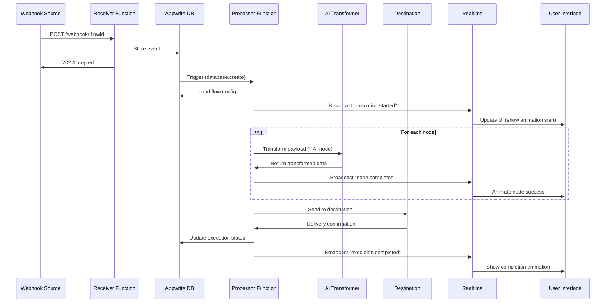

# EventMesh - Technical Architecture

## 🎯 Vision
The developer's global event routing network - combining real-time event streaming, AI-powered transformation, and visual flow orchestration.

---

## 🏗️ System Architecture

```
┌─────────────────────────────────────────────────────────────────┐
│                         CLIENT LAYER                             │
├─────────────────────────────────────────────────────────────────┤
│  Next.js 14 (App Router) + TypeScript + TailwindCSS             │
│  - Visual Flow Builder (React Flow)                              │
│  - Real-time Event Dashboard                                     │
│  - AI Chat Interface                                             │
│  - Analytics & Monitoring                                        │
└─────────────────────────────────────────────────────────────────┘
                              ↓ ↑
┌─────────────────────────────────────────────────────────────────┐
│                      ORCHESTRATION LAYER                         │
├─────────────────────────────────────────────────────────────────┤
│  Appwrite Functions (Node.js 20)                                 │
│  ┌──────────────┬──────────────┬──────────────┬──────────────┐ │
│  │   Webhook    │    Event     │   AI Trans-  │   Router     │ │
│  │   Receiver   │   Processor  │   former     │   Executor   │ │
│  └──────────────┴──────────────┴──────────────┴──────────────┘ │
└─────────────────────────────────────────────────────────────────┘
                              ↓ ↑
┌─────────────────────────────────────────────────────────────────┐
│                         DATA LAYER                               │
├─────────────────────────────────────────────────────────────────┤
│  Appwrite Database (Collections)                                 │
│  - workspaces      - flows          - nodes                      │
│  - events          - rules          - destinations               │
│  - executions      - analytics      - api_keys                   │
│                                                                   │
│  Appwrite Storage (Buckets)                                      │
│  - event-payloads  - execution-logs - flow-snapshots             │
│                                                                   │
│  Appwrite Realtime (Subscriptions)                               │
│  - Live event streaming                                          │
│  - Flow execution status                                         │
│  - Analytics updates                                             │
└─────────────────────────────────────────────────────────────────┘
                              ↓ ↑
┌─────────────────────────────────────────────────────────────────┐
│                      EXTERNAL SERVICES                           │
├─────────────────────────────────────────────────────────────────┤
│  - OpenAI GPT-4 (AI Transformations & Flow Generation)          │
│  - Destination APIs (Slack, Discord, Webhooks, etc.)            │
│  - Analytics Processors (Real-time metrics)                      │
└─────────────────────────────────────────────────────────────────┘
```

---

## 📊 Database Schema

### Collections

#### 1. **workspaces**
```json
{
  "$id": "workspace_id",
  "name": "My Workspace",
  "owner_id": "user_id",
  "created_at": "2025-01-01T00:00:00Z",
  "settings": {
    "timezone": "UTC",
    "retention_days": 30
  }
}
```

#### 2. **flows**
```json
{
  "$id": "flow_id",
  "workspace_id": "workspace_id",
  "name": "GitHub to Slack",
  "description": "Forward GitHub events to Slack",
  "status": "active|paused|draft",
  "nodes": [
    {
      "id": "node_1",
      "type": "source|transform|destination",
      "config": {},
      "position": {"x": 0, "y": 0}
    }
  ],
  "edges": [
    {"source": "node_1", "target": "node_2"}
  ],
  "created_at": "2025-01-01T00:00:00Z",
  "updated_at": "2025-01-01T00:00:00Z"
}
```

#### 3. **events**
```json
{
  "$id": "event_id",
  "workspace_id": "workspace_id",
  "flow_id": "flow_id",
  "source": "github|stripe|custom",
  "event_type": "push|payment.succeeded",
  "payload": {},
  "headers": {},
  "received_at": "2025-01-01T00:00:00Z",
  "status": "pending|processing|completed|failed",
  "execution_id": "execution_id"
}
```

#### 4. **executions**
```json
{
  "$id": "execution_id",
  "event_id": "event_id",
  "flow_id": "flow_id",
  "status": "running|success|failed",
  "started_at": "2025-01-01T00:00:00Z",
  "completed_at": "2025-01-01T00:00:00Z",
  "duration_ms": 1234,
  "node_executions": [
    {
      "node_id": "node_1",
      "status": "success|failed",
      "input": {},
      "output": {},
      "error": null,
      "duration_ms": 100
    }
  ],
  "metrics": {
    "total_nodes": 5,
    "successful_nodes": 4,
    "failed_nodes": 1
  }
}
```

#### 5. **rules**
```json
{
  "$id": "rule_id",
  "flow_id": "flow_id",
  "node_id": "node_id",
  "conditions": [
    {
      "field": "payload.action",
      "operator": "equals|contains|regex",
      "value": "push"
    }
  ],
  "logic": "AND|OR",
  "actions": [
    {
      "type": "route|transform|notify",
      "config": {}
    }
  ]
}
```

#### 6. **destinations**
```json
{
  "$id": "destination_id",
  "workspace_id": "workspace_id",
  "type": "slack|discord|webhook|email",
  "name": "Engineering Slack",
  "config": {
    "webhook_url": "https://hooks.slack.com/...",
    "channel": "#engineering"
  },
  "auth": {
    "type": "bearer|oauth|apikey",
    "credentials": {}
  },
  "created_at": "2025-01-01T00:00:00Z"
}
```

#### 7. **api_keys**
```json
{
  "$id": "key_id",
  "workspace_id": "workspace_id",
  "key_hash": "hashed_api_key",
  "name": "Production Key",
  "permissions": ["events:write", "flows:read"],
  "last_used_at": "2025-01-01T00:00:00Z",
  "created_at": "2025-01-01T00:00:00Z",
  "expires_at": null
}
```

#### 8. **analytics**
```json
{
  "$id": "analytics_id",
  "workspace_id": "workspace_id",
  "flow_id": "flow_id",
  "date": "2025-01-01",
  "hour": 14,
  "metrics": {
    "total_events": 1000,
    "successful_executions": 980,
    "failed_executions": 20,
    "avg_latency_ms": 250,
    "p95_latency_ms": 450,
    "p99_latency_ms": 800
  }
}
```

---

## 🔧 Appwrite Functions

### 1. **webhook-receiver**
- **Trigger**: HTTP (POST /webhook/:flow_id)
- **Purpose**: Receive incoming webhooks, validate, store event
- **Flow**:
  1. Validate API key
  2. Parse payload + headers
  3. Store in `events` collection
  4. Trigger event processor
  5. Return acknowledgment

### 2. **event-processor**
- **Trigger**: Database event (events.create)
- **Purpose**: Process event through flow
- **Flow**:
  1. Load flow configuration
  2. Create execution record
  3. Execute nodes in DAG order
  4. Update execution status
  5. Broadcast via Realtime

### 3. **ai-transformer**
- **Trigger**: HTTP (POST /ai/transform)
- **Purpose**: AI-powered payload analysis and transformation
- **Flow**:
  1. Analyze payload structure
  2. Generate transformation suggestions
  3. Apply transformations
  4. Return transformed payload + code

### 4. **ai-flow-generator**
- **Trigger**: HTTP (POST /ai/generate-flow)
- **Purpose**: Generate flow from natural language
- **Flow**:
  1. Parse user intent
  2. Generate node configuration
  3. Create flow in database
  4. Return flow ID + visualization

### 5. **router-executor**
- **Trigger**: Internal (called by event-processor)
- **Purpose**: Execute routing rules and deliver to destinations
- **Flow**:
  1. Evaluate conditions
  2. Apply transformations
  3. Deliver to destination(s)
  4. Retry on failure
  5. Log results

### 6. **analytics-aggregator**
- **Trigger**: Scheduled (every 5 minutes)
- **Purpose**: Aggregate metrics for analytics
- **Flow**:
  1. Query recent executions
  2. Calculate metrics
  3. Store in analytics collection
  4. Broadcast updates via Realtime

---

## 🎨 Frontend Architecture

### Tech Stack
- **Framework**: Next.js 14 (App Router)
- **Language**: TypeScript
- **Styling**: TailwindCSS + shadcn/ui
- **State**: Zustand + React Query
- **Realtime**: Appwrite Realtime SDK
- **Visualization**: React Flow + D3.js
- **Animation**: Framer Motion
- **Charts**: Recharts

### Page Structure

```
/app
├── (auth)
│   ├── login
│   └── signup
├── (dashboard)
│   ├── page.tsx                    # Dashboard home
│   ├── flows
│   │   ├── page.tsx                # Flow list
│   │   ├── [id]
│   │   │   ├── page.tsx            # Flow builder (main)
│   │   │   ├── analytics
│   │   │   └── settings
│   │   └── new
│   ├── events
│   │   ├── page.tsx                # Event list
│   │   └── [id]                    # Event detail + replay
│   ├── destinations
│   │   ├── page.tsx                # Destination management
│   │   └── new
│   ├── analytics                   # Global analytics
│   ├── settings
│   │   ├── workspace
│   │   ├── api-keys
│   │   └── team
│   └── playground                  # Webhook testing tool
├── api
│   ├── webhook/[flowId]            # Webhook receiver endpoint
│   └── ai
│       ├── transform
│       └── generate-flow
└── (marketing)
    ├── page.tsx                    # Landing page
    ├── docs
    └── pricing
```

### Key Components

#### 1. **FlowBuilder** (The Star Feature 🌟)
```tsx
// Real-time visual flow editor
- Drag-and-drop nodes (source, transform, destination)
- Live event animation (particles flowing through edges)
- AI assistant sidebar
- Node configuration panel
- Real-time collaboration (see other users' cursors)
```

#### 2. **EventStream** (Real-time Dashboard)
```tsx
// Live event feed with filtering
- Real-time event cards
- Payload inspector
- Quick actions (replay, debug, clone)
- Status indicators (success/failed)
```

#### 3. **AITransformAssistant**
```tsx
// AI chat interface for transformations
- Natural language queries
- Code generation
- Transformation suggestions
- Auto-apply to flow
```

#### 4. **AnalyticsDashboard**
```tsx
// Real-time metrics visualization
- Throughput graphs
- Latency heatmaps
- Error rate trends
- Geographic distribution (if multi-region)
```

#### 5. **PlaygroundTester**
```tsx
// Webhook testing tool
- cURL generator
- Request builder
- Response inspector
- Save as templates
```

---

## 🤖 AI Features Implementation

### 1. **Payload Analysis**
```typescript
// OpenAI Function Calling
{
  "name": "analyze_payload",
  "description": "Analyze webhook payload structure",
  "parameters": {
    "payload": object,
    "source": string
  },
  "returns": {
    "schema": JSONSchema,
    "suggestions": TransformationSuggestion[],
    "security_concerns": string[]
  }
}
```

### 2. **Transformation Generator**
```typescript
// Generate transformation code
{
  "input_schema": JSONSchema,
  "output_schema": JSONSchema,
  "language": "javascript|python",
  "returns": {
    "code": string,
    "explanation": string,
    "test_cases": TestCase[]
  }
}
```

### 3. **Flow Generator**
```typescript
// Natural language to flow
{
  "intent": "When GitHub push happens, send to Slack",
  "returns": {
    "nodes": Node[],
    "edges": Edge[],
    "confidence": number,
    "suggested_improvements": string[]
  }
}
```

---

## 🎬 Event Flow Execution



---

## 🔐 Security Architecture

### API Key Authentication
```typescript
// Webhook endpoints
Authorization: Bearer em_live_xyz123...

// Key validation flow
1. Extract key from header
2. Hash and compare with db
3. Check permissions
4. Rate limit by key
5. Log usage
```

### Payload Encryption
```typescript
// Sensitive data at rest
- Encrypt destination credentials (AES-256)
- Hash API keys (bcrypt)
- PII detection in payloads (optional masking)
```

### Rate Limiting
```typescript
// Per workspace/API key
{
  "free_tier": "100 events/hour",
  "pro_tier": "10,000 events/hour",
  "enterprise": "unlimited"
}
```

---

## 📈 Scalability Strategy

### Horizontal Scaling
- Appwrite Functions auto-scale
- Event queue for burst traffic
- Database indexing on:
  - `workspace_id`
  - `flow_id`
  - `created_at`
  - `status`

### Performance Optimizations
- Payload compression (gzip)
- Lazy loading of large payloads
- Real-time subscription filtering
- CDN for static assets

### Monitoring
- Function execution metrics
- Database query performance
- Real-time connection count
- Error tracking (Sentry)

---

## 🎯 Demo Script (Hackathon Presentation)

### Scene 1: The Problem (30s)
"Developers spend hours debugging webhook integrations. Let me show you a failed Stripe webhook..."

### Scene 2: EventMesh (2min)
1. Create new flow (visual builder)
2. AI assistant: "I want GitHub pushes to go to Slack"
3. Watch AI auto-generate flow
4. Trigger a real GitHub webhook
5. Show live animation of event flowing
6. See Slack message appear
7. Replay the event with modified payload
8. Show analytics dashboard

### Scene 3: Advanced Features (1min)
- Multi-destination routing
- AI payload transformation
- Error handling + retries
- Analytics insights

### Scene 4: The Vision (30s)
"EventMesh makes webhook debugging and routing visual, intelligent, and delightful. Built entirely on Appwrite."

---

## 🚀 MVP Priority (5-Day Build)

### Must Have (Core Demo)
✅ Visual flow builder (React Flow)
✅ Webhook receiver function
✅ Real-time event streaming
✅ Basic routing (1 source → 1 destination)
✅ Event replay
✅ AI transformation (1 feature: auto-detect schema)

### Should Have (Impressive)
✅ Live event animation
✅ Analytics dashboard
✅ Multiple destinations (Slack, Discord, Webhook)
✅ Playground/tester
✅ Beautiful UI

### Nice to Have (Time Permitting)
⚠️ AI flow generation from NLP
⚠️ Multi-region nodes
⚠️ Marketplace templates
⚠️ CLI tool

---

## 📦 Tech Stack Summary

| Layer | Technology |
|-------|-----------|
| **Frontend** | Next.js 14, TypeScript, TailwindCSS, shadcn/ui |
| **Visualization** | React Flow, D3.js, Framer Motion |
| **Backend** | Appwrite (Functions, DB, Storage, Realtime, Auth) |
| **AI** | OpenAI GPT-4 |
| **Deployment** | Vercel (frontend), Appwrite Cloud (backend) |
| **Analytics** | Custom (Appwrite DB + Recharts) |
| **Monitoring** | Appwrite Console + Custom dashboard |

---

## 🎨 Design System

### Color Palette (Dark Mode First)
```css
--background: 0 0% 3.9%;
--foreground: 0 0% 98%;
--primary: 142 71% 45%; /* Green for success/active */
--secondary: 217 91% 60%; /* Blue for info */
--accent: 47 96% 53%; /* Yellow for AI features */
--destructive: 0 84% 60%; /* Red for errors */
--muted: 0 0% 15%;
```

### Typography
- **Headings**: Inter (700)
- **Body**: Inter (400)
- **Code**: JetBrains Mono

### Animation Principles
- Event flow: Smooth particles (Framer Motion)
- Node success: Pulse effect
- Error states: Shake animation
- Loading: Skeleton + shimmer

---

## 📄 File Structure

```
eventmesh/
├── app/                          # Next.js app
├── components/                   # React components
│   ├── ui/                       # shadcn components
│   ├── flow/                     # Flow builder components
│   ├── events/                   # Event-related components
│   └── analytics/                # Analytics components
├── lib/                          # Utilities
│   ├── appwrite.ts               # Appwrite client
│   ├── openai.ts                 # OpenAI client
│   ├── utils.ts                  # Helpers
│   └── types.ts                  # TypeScript types
├── hooks/                        # React hooks
│   ├── useRealtime.ts
│   ├── useFlowBuilder.ts
│   └── useEventStream.ts
├── store/                        # Zustand stores
│   ├── flowStore.ts
│   └── eventStore.ts
├── functions/                    # Appwrite Functions
│   ├── webhook-receiver/
│   ├── event-processor/
│   ├── ai-transformer/
│   └── router-executor/
├── public/                       # Static assets
├── docs/                         # Documentation
└── scripts/                      # Setup scripts
```

---

**This is the foundation. Now let's build it.** 🚀
